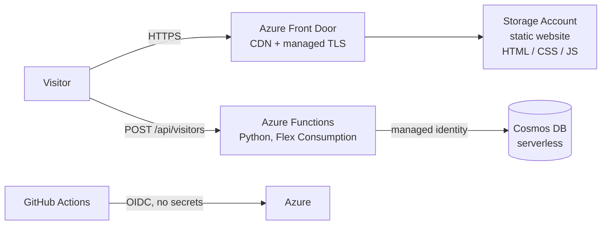

# Cloud Resume Challenge — Azure

My resume as a serverless website on Azure, with a live visitor counter, built for the
[Cloud Resume Challenge](https://cloudresumechallenge.dev/docs/the-challenge/azure/).

**Live site:** https://your-domain.example &nbsp;·&nbsp; **Blog post:** _link here_


## Architecture



| Challenge step | Implementation |
|---|---|
| Certification | AZ-900 Azure Fundamentals |
| HTML / CSS | [`frontend/`](frontend/) |
| Static website | Azure Storage static website |
| HTTPS + DNS | Azure Front Door Standard with a managed certificate |
| JavaScript | [`frontend/counter.js`](frontend/counter.js) |
| Database | Cosmos DB (NoSQL API, serverless), atomic `incr` patch |
| API + Python | Azure Functions, Python v2 model: [`backend/function_app.py`](backend/function_app.py) |
| Tests | pytest: [`backend/tests/`](backend/tests/) |
| Infrastructure as code | Terraform: [`infra/`](infra/) |
| CI/CD | GitHub Actions: [`.github/workflows/`](.github/workflows/) |

### Design choices

- **No secrets anywhere.** GitHub Actions logs in to Azure with OIDC through a user-assigned managed
  identity. The Function App reaches Cosmos DB with its own managed identity and Cosmos DB RBAC,
  so no database key exists in app settings.
- **Race-safe counter.** Uses Cosmos DB's server-side `incr` patch, so simultaneous visitors
  don't overwrite each other.
- **Least privilege.** The CI identity is Contributor on one resource group only.
- **Cost-aware.** Front Door (~$35/month) sits behind a flag (`enable_front_door`); everything
  else costs cents per month.

## Repo layout

```
frontend/            static site (index.html, styles.css, counter.js)
backend/             Python Azure Function + pytest tests
infra/               Terraform
scripts/bootstrap.ps1  one-time setup: state storage, CI identity, roles
.github/workflows/   infra.yml, backend.yml, frontend.yml
```

## Setup

### 0. Install tools (Windows)

```powershell
winget install Hashicorp.Terraform
winget install Microsoft.AzureCLI
winget install Microsoft.Azure.FunctionsCoreTools   # optional, to run the API locally
```

### 1. Create the GitHub repo and bootstrap Azure

Create an empty GitHub repo (e.g. `cloud-resume-azure`) on your **personal** account, then:

```powershell
az login
./scripts/bootstrap.ps1 -GitHubRepo "your-username/cloud-resume-azure"
```

Add the variables it prints under **Settings → Secrets and variables → Actions → Variables**.

### 2. First deploy of the infrastructure

Run it locally the first time so you can see what happens:

```powershell
cd infra
copy terraform.tfvars.example terraform.tfvars   # then edit subscription_id
terraform init -backend-config=backend.hcl
terraform plan
terraform apply
terraform output
```

Add these outputs as more GitHub variables: `SITE_STORAGE_ACCOUNT`, `FUNCTION_APP_NAME`, `API_URL`.

### 3. Push and let CI/CD deploy

```powershell
git add .
git commit -m "Initial commit"
git push -u origin main
```

Pushing to `main` runs the three workflows. Pull requests run tests and `terraform plan` only.

### 4. HTTPS + custom domain (when ready)

1. Buy a domain from a registrar with your personal account (Cloudflare, Namecheap…).
2. Set the GitHub variables `ENABLE_FRONT_DOOR=true` and `CUSTOM_DOMAIN=resume.yourdomain.com`
   (and the same in `terraform.tfvars`), then apply.
3. At your DNS provider, add:
   - `CNAME resume → <custom_domain_cname_target output>`
   - `TXT _dnsauth.resume → <custom_domain_validation_txt output>`
4. Set `FRONT_DOOR_PROFILE` and `FRONT_DOOR_ENDPOINT` so frontend deploys purge the cache.

Certificate provisioning can take 15–60 minutes.

## Local development

```powershell
cd backend
python -m venv .venv
.venv\Scripts\activate
pip install -r requirements-dev.txt
pytest

copy local.settings.example.json local.settings.json   # set COSMOS_ENDPOINT
func start    # API at http://localhost:7071/api/visitors
```

Then serve `frontend/` with any static server on port 5500 (e.g. VS Code Live Server).
`config.js` already points at the local API.

Running the API locally uses your `az login` identity, so grant yourself the Cosmos DB data role once:

```powershell
az cosmosdb sql role assignment create -g rg-cloudresume -a <cosmos-account-name> `
  --role-definition-id 00000000-0000-0000-0000-000000000002 `
  --principal-id $(az ad signed-in-user show --query id -o tsv) `
  --scope "/"
```

## Tear down

```powershell
cd infra
terraform destroy
```

Everything can be recreated from this repo, in any subscription, by re-running the steps above.
